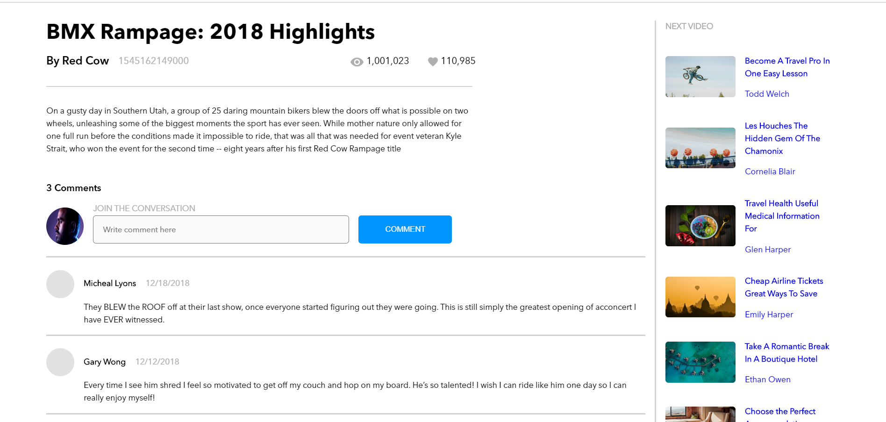

# Brainflix
A video streaming service project

A simple streaming responsive web app built using React, SASS, NodeJS that displays (currently videos are not being played):
- Main Video
- Side Videos
- Change Video when any side video is clicked
- An Upload page

Video data is being stored as JSON files in NodeJs

# Screenshots

## Main Page

## Main Page Bottom

## Upload Page

## Mobile View Main

## Mobile View Main Comments

## Mobile View Side Videos

## Mobile View Upload

